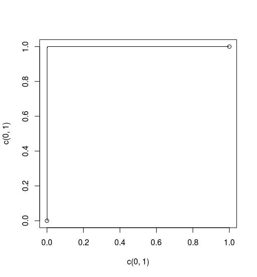
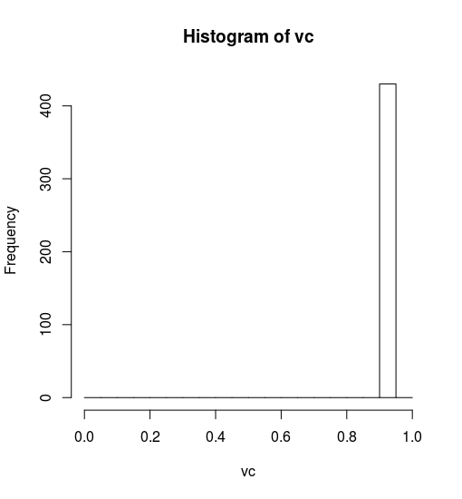
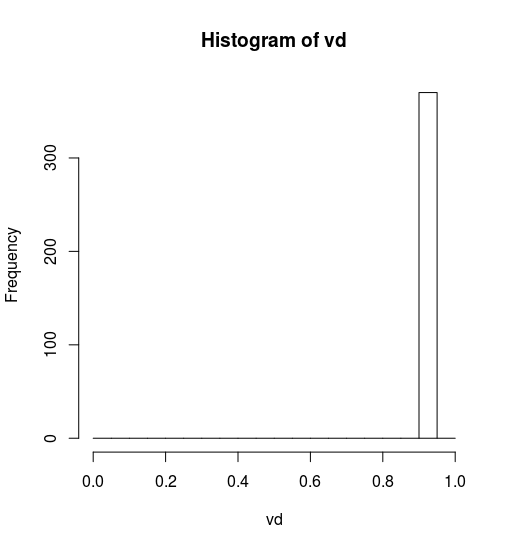
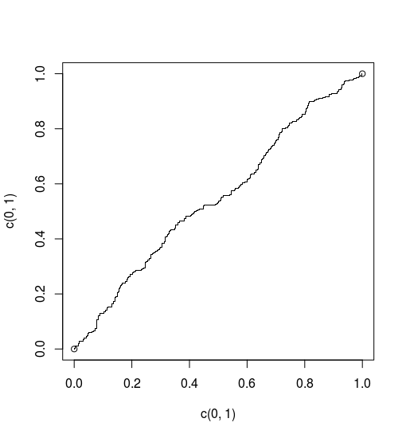
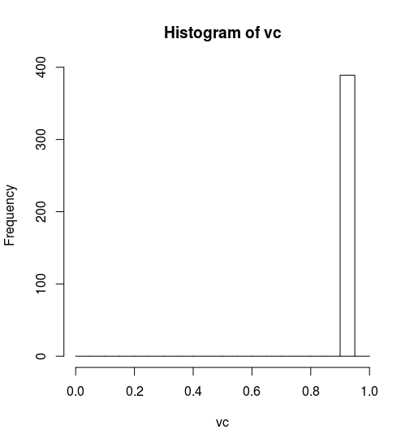
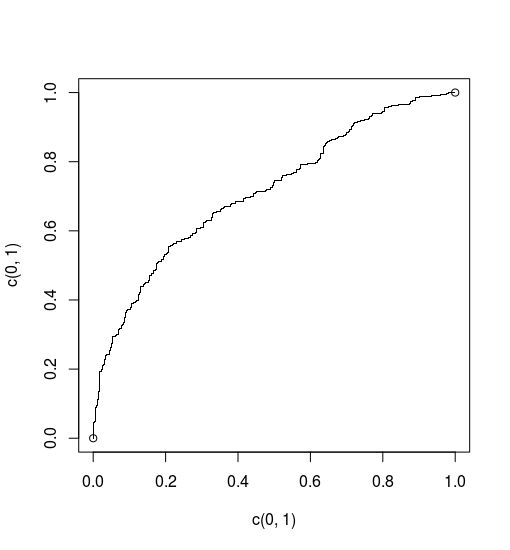

```{r setup, include=FALSE}
knitr::opts_chunk$set(echo = FALSE)
```


##  Code A & B

```{}
ALPHA=0.05 # learning rate parameter
# 5 inputs, 2 hidden layers, with 8 and 5 nodes , 1 output
nodes=c(5,8,5,1) 
# 3 sets of weights
nlayers=length(nodes) -1 
net=list() # set up empty list
# net[[ j ]] holds weight matrix feeding nodes
#of layer j+1 from nodes in layer j
# make weights and fill with random numbers
for(j in 1:nlayers) net[[ j ]] <- matrix(runif(nodes[ j ]*nodes[ j +1 ]),
nodes[j+1],nodes[j])
netsays <- function(x) { 
# Returns net output for some input vector x
  for(j in 1:nlayers) x <- 1/(1+exp(-net[[ j ]] %*% x))
  return(x)
}
backprop <- function(layer,n1,n2,factor){ # 
recursive function used for back-propagation
  if(layer>1) for(n in 1:nodes[layer-1])
    backprop(layer-1,n2,n,factor*net[[layer]][n1,
    n2]*r[[iayer]][n2]*(1-r[[layer]][n2]))
  net[[layer]][n1,n2] <<- net[[layer]][n1,
  n2] - ALPHA*factor*r[[layer]][n2]
}
netlearns <- function(x,truth) { # like netsays but changes weights
  r <<- list() # to contain the outputs of all nodes in all layers
  r[[1]] <<- x # the input layer
  for(layer in 1:nlayers) r[[layer+1]] <<- as.vector(1/(1+exp(-net[[layer]]
  %*% r[[layer]])))
  u <- r[[nlayers+1]] # final answer, for convenience
  for(n in 1:nodes[nlayers]) backprop(nlayers,1,n,
  (u-truth)*u*(1-u))
}

```


```{}

sample <- read.table("data/Sample2", header=FALSE)

# Random sampling
samplesize = 0.80 * nrow(sample)
set.seed(1234)
index = sample( seq_len ( nrow ( sample ) ),
size = samplesize )


## Scale data for neural network
max = apply(sample , 2 , max)
min = apply(sample,2 , min)
scaled = as.data.frame(scale( sample, center = min,
scale = max - min))


# creating training and test set
trainNN = scaled[index , ]
testNN = scaled[-index , ]


```


```{}


Nsample <- dim(trainNN)[1]
print(head(trainNN))
for (i in 1:Nsample) {print(trainNN[i,1]);
print(trainNN[i,-1])}
plot(c(0,1),c(0,1))
v <- netsays(t(trainNN[,-1]))
p <- trainNN[order(v),1]
nc <- sum(trainNN[,1]==0)
nd <- Nsample-nc
nnc <- nc
nnd <- nd
for (i in 1:length(p)) 
{if(p[i]==1) 
{nd <- nd-1} else {nc <- nc-1}
  points(nc/nnc,nd/nnd,pch='.') }
vc <- rep(0,nnc)
vd <- rep(0,nnd)
nc <- 0
nd <- 0
for (i in 1:Nsample){
  itype <- trainNN[i,1]
  isay <- netsays(as.numeric(trainNN[i,-1]))
  if(itype==0) {nc <- nc+1;vc[nc] <- isay}
  else {nd<- nd+1;vd[nd] <- isay} }
hc <- hist(vc,breaks=seq(0,1,.05))
hd <- hist(vd,breaks=seq(0,1,.05))
```

#### Output of Sample 1 with Alpha = 0.05

{width=30% }{width=30%}
{width=30% }


#### Output of Sample 2 with Alpha = 0.05

{width=30% }{width=30%}
{width=30% }

#### Output of Sample 3 with Alpha = 0.05

{width=30% }{width=30%}
{width=30% }


### Answers

* It determine the learning rate of the algorithm
* the more the node, the higher the processing time.
* the more the hidden layer, the more the layers
* It’s helpful to  remove the outlighters
* we can use either of the function as an activation function
* The performance is not good.

